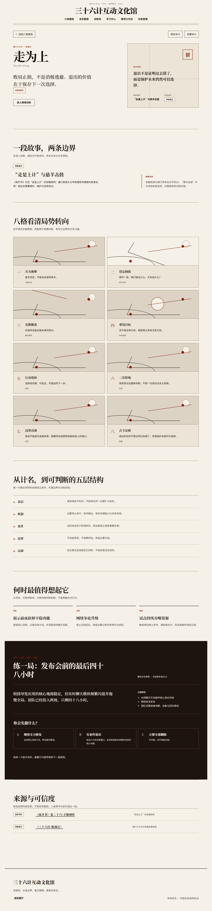
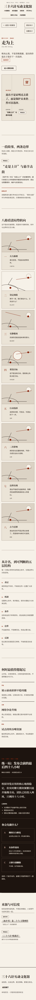
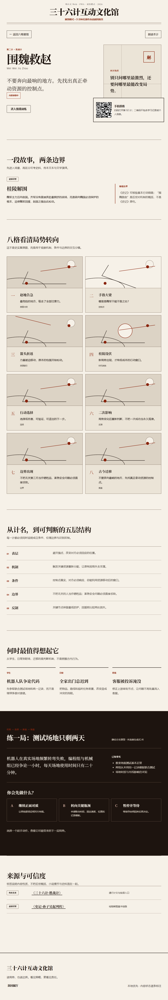

# AI 三十六计互动文化馆

以《三十六计》为文化内容底座，通过经典场景、漫画脚本、哲学拆解和 AI 情境训练，帮助学生、大众读者和职场用户理解局势、成立条件、风险、伦理边界与反制方法。

当前仓库已完成阶段 A/B/C 的**仓库内软件交付**：36 计与六卷展馆、24 个训练案例、本地检索导览、关系图谱、学习中心、教师/审核工作台、可安装离线 PWA 和 Kiosk 软件模式均可运行。真实用户测试、应用商店上架、真实展馆硬件连续运行和机构合作仍须外部证据，不在仓库内伪造完成。



手机端与展馆模式：





## 本地运行

```bash
npm install
npm run dev
```

浏览器打开终端显示的本地地址。其他验证命令：

```bash
npm test
npm run check
npm run build
```

生产构建后可用 `/?mode=kiosk` 进入展馆模式；普通页面可由浏览器安装为 PWA。

## 当前内容

- [完整产品设计](./docs/plans/2026-08-27-ai-thirty-six-stratagems-design.md)
- [三个概念验证计策的选择与验收规则](./content/prototypes/README.md)
- [第二计·围魏救赵](./content/prototypes/02-wei-rescue-zhao.md)
- [第三计·借刀杀人](./content/prototypes/03-borrowed-knife.md)
- [第三十六计·走为上](./content/prototypes/36-retreat-is-best.md)
- [响应式 Web 原型实现计划](./docs/plans/2026-08-27-responsive-web-prototype-implementation.md)
- [移动端真实运行截图](./docs/screenshots/web-prototype-mobile.png)
- [阶段 A/B/C 验收矩阵](./docs/verification/stages-abc-matrix.md)
- [展馆 Kiosk 运行手册](./docs/operations/kiosk-runbook.md)
- [移动端发布检查表](./docs/operations/mobile-release-checklist.md)
- [未来服务端 OpenAPI 契约](./docs/api/openapi.yaml)

## 产品结构

产品采用“六卷互动文化馆 + AI 谋略训练场 + 三十六计知识底座”的结构：

- 六卷文化馆负责空间化探索与体系认知。
- 单计展厅负责漫画、哲学、经典场景、适用条件、风险和反制。
- AI 训练场采用“识局—选择—推演—复盘”，不直接给出单一计策答案。
- 内容后台区分史料、传统说法、文学演绎、编辑解读与现代虚构。

## 原型数据链路

```text
审核中的内容样稿
  → TypeScript 内容模型
  → 展厅 / 漫画 / 五层哲学 / 现代场景
  → 用户选择静态情境分支
  → 四维复盘反馈
```

当前版本没有后端、账户、数据库或模型调用。情境反馈来自仓库内可审阅的静态分支；导览采用本地可解释检索，页面明确显示未连接生成式 AI。未来服务端和模型接入必须遵循显式 Provider 与 OpenAPI 契约，未配置时明确失败，不静默改用其他模型。

## 内容原则

1. 不把文学故事当作历史事实。
2. 不把三十六计表达成操纵、欺骗或伤害他人的技巧。
3. 每一计同时说明适用条件、不适用条件、风险和反制。
4. AI 训练优先提供沟通、合作、正规程序和不行动等替代方案。
5. 未经人工审核的 AI 内容不自动公开发布。

## 概念验证选题

| 计策 | 验证重点 |
|---|---|
| 围魏救赵 | 《史记》史实与间接解局机制 |
| 借刀杀人 | 文学演绎、伦理边界、反操纵与复合计策 |
| 走为上 | 败局止损、退出机制与传统说法的可信度标签 |

## 项目状态

- [x] 产品定义与页面结构
- [x] AI 训练机制与安全边界
- [x] 内容数据模型与审核流程
- [x] 三个概念验证内容样稿
- [x] 高保真响应式 Web 原型（三计）
- [x] 36 计知识底座、六卷展馆与 24 个训练案例
- [x] 本地进度、教师工具、内容审核领域契约
- [x] 可安装离线 PWA 与 Kiosk 软件模式
- [ ] 最终手绘/动画成品资产生产
- [ ] 外部真实用户、应用商店、硬件展馆和机构合作验收

## 说明

仓库中的内容样稿仍处于编辑与专家审核阶段。古籍链接用于说明资料入口；正式发布前仍需进行版本核对、历史审读、文学审读和真实用户测试。公开仓库地址：[github.com/topbat/new36](https://github.com/topbat/new36)。
