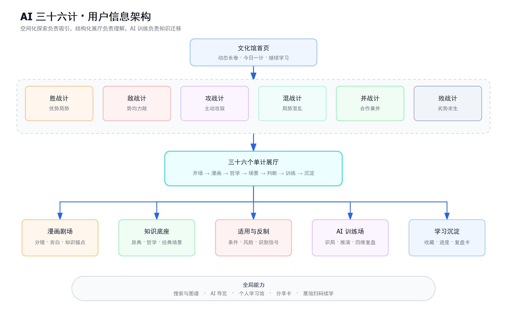
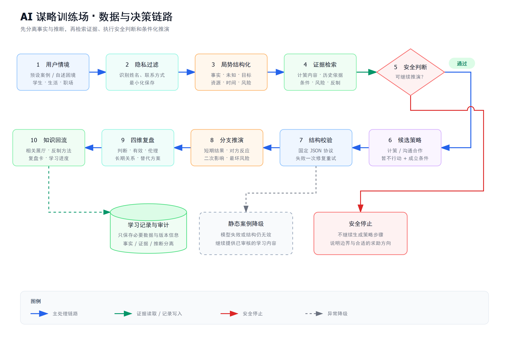
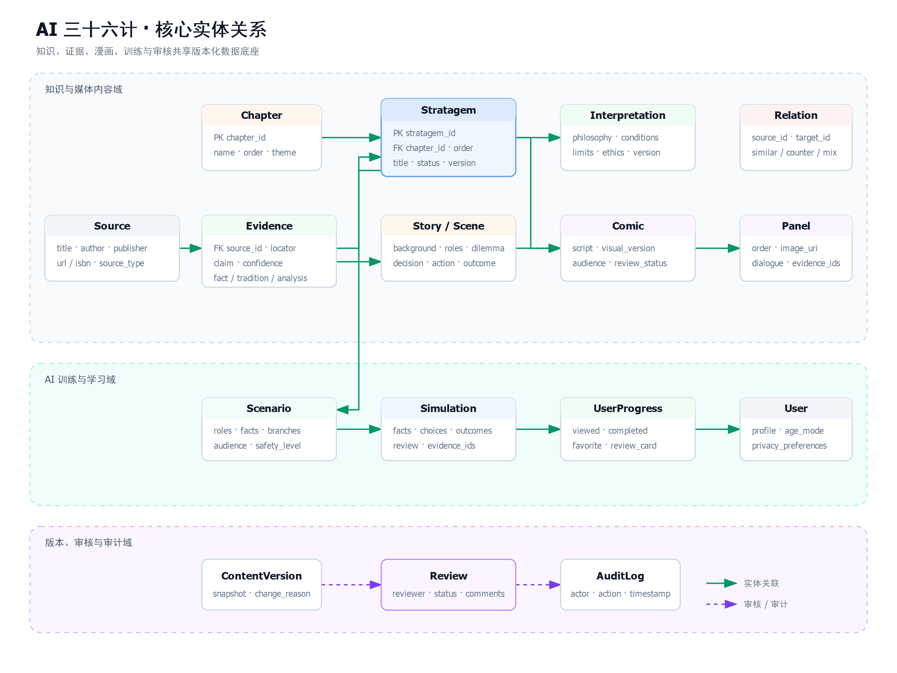

# AI 三十六计互动文化馆产品设计

> 文档状态：已确认的产品方案  
> 日期：2026-08-27  
> 首发载体：响应式 Web / PWA  
> 预留载体：移动 App、展馆 Kiosk  
> 目标用户：学生、大众读者、职场人群

## 1. 产品定义

本产品以《三十六计》为文化内容底座，以“六卷互动文化馆”为主体，以 AI 谋略训练场为特色能力，以可考据的知识百科为支撑。它通过经典故事、漫画分镜、哲学拆解、现代情境与分支推演，帮助用户完成从“知道计名”到“理解局势、判断条件、预见后果”的认知升级。

一句话定义：

> 一个面向学生、大众读者和职场人群，通过漫画叙事、文化导览和 AI 情境推演，解释三十六计哲学、适用条件、风险与反制方法的互动数字文化馆。

它不是“教人算计”的工具。产品将三十六计定义为识局与思辨材料，强调信息判断、时机、虚实、力量转换、长期关系和伦理边界；在冲突场景中优先呈现沟通、合作、求助和不行动等替代方案。

## 2. 产品目标与非目标

### 2.1 产品目标

1. 让用户愿意进入：用当代东方视觉、漫画和空间化游览降低古典内容门槛。
2. 让用户真正理解：解释每一计处理的矛盾、成立条件、局限和代价。
3. 让用户学会判断：通过 AI 情境训练分辨“是否适用”，而非机械套用计策。
4. 让内容可信可审：区分史实、传统说法、学理解读与创作演绎，并保留来源和版本。
5. 让内容可复用：同一套结构化内容服务 Web、App、展馆和课堂模式。

### 2.2 非目标

- 不提供报复、欺凌、作弊、欺骗或侵犯隐私的操作方案。
- 不把历史文学故事包装成确定史实。
- 不在首版建设社区、公开评论、多人竞技、积分商城或全站 3D。
- 不让未经人工审核的 AI 内容自动公开发布。
- 不以 AI 结论替代法律、人事、财务或心理等专业建议。

## 3. 用户与核心任务

| 用户 | 核心需求 | 推荐入口 | 理想结果 |
|---|---|---|---|
| 学生 | 看懂典故、理解思想、完成课堂讨论 | 漫画、六卷导览、学生训练 | 能用自己的话说明计策条件与风险 |
| 大众读者 | 轻松探索传统文化并联系现实 | 今日一计、经典场景、图谱 | 从故事兴趣转化为系统理解 |
| 职场人 | 分析复杂局势、识别风险和他人策略 | 职场训练、适用判断、反制 | 形成多方案思考，而非获得“套路” |
| 教师/讲解员 | 组织课程、讨论或展陈 | 课堂卡、展馆模式、二维码续学 | 快速调用可信内容和讨论题 |
| 编辑/审核员 | 生产、核验、发布与修订内容 | 内容管理后台 | 每条公开信息可追源、可回滚、可审计 |

## 4. 设计原则

1. **先故事，后概念**：用人物困局建立兴趣，再解释哲学，不从抽象定义起步。
2. **先识局，后用计**：AI 必须先梳理事实、未知信息和目标，再给出候选思路。
3. **条件化表达**：所有策略都必须说明成立条件、不适用情况、风险和反制。
4. **事实与演绎分层**：史实、传统说法、解释和创作使用不同标签与视觉样式。
5. **短期与长期并看**：推演同时展示即时效果、二次影响和长期关系。
6. **少即是多**：首版用六篇标杆漫画建立品质，不用低质量批量生成填满三十六篇。
7. **同源多端**：内容、用户进度和 AI 协议保持终端无关，展示层按设备适配。

## 5. 信息架构



文化馆采用“空间化探索 + 结构化知识”的混合结构。首页负责氛围和发现，六卷展区负责建立体系，单计展厅负责深度理解，图谱与搜索负责跨计策检索，AI 训练负责知识迁移，个人学习馆负责沉淀。

六卷分别为：胜战计、敌战计、攻战计、混战计、并战计、败战计。每卷不是六张孤立卡片，而是一个说明共同局势、内部差异、相互组合和推荐顺序的主题展区。

## 6. 页面清单

| 编号 | 页面/模块 | 核心内容 | MVP |
|---|---|---|---|
| P01 | 文化馆首页 | 动态山河长卷、六卷入口、今日一计、继续学习 | 是 |
| P02 | 六卷展区 × 6 | 篇章局势、六计关系、游览路线、完成度 | 是 |
| P03 | 单计展厅 × 36 | 漫画、哲学、经典场景、条件、风险、反制、训练 | 是 |
| P04 | 漫画阅读器 | 分镜阅读、旁白、史实/演绎标记、知识锚点 | 是 |
| P05 | AI 训练场首页 | 学生/生活/职场入口、预设案例、隐私提示 | 是 |
| P06 | 情境识局 | 角色、目标、事实、未知、压力、资源和风险 | 是 |
| P07 | 分支推演 | 候选策略、用户理由、多分支结果和二次影响 | 是 |
| P08 | 四维复盘 | 判断、有效性、伦理、长期关系、关联知识 | 是 |
| P09 | 三十六计图谱 | 相似、组合、冲突、反制关系与多维筛选 | 是 |
| P10 | 搜索与 AI 导览 | 关键词/语义搜索、自然语言导览 | 是 |
| P11 | 个人学习馆 | 进度、收藏、复盘卡、错题和最近浏览 | 是 |
| P12 | 内容管理后台 | 内容、史料、漫画、案例、版本和发布 | 是 |
| P13 | 课堂模式 | 讨论卡、投屏、教师控制、课堂任务 | 后续 |
| P14 | 展馆 Kiosk | 大屏探索、多人触控、自动复位、扫码续学 | 预留 |

### 6.1 响应式规则

- 桌面端：突出空间长卷、双栏/三栏对照、图谱和漫画旁注。
- 手机端：单列分镜、底部导航、分步推演；核心按钮单手可达，禁止横向溢出。
- 展馆端：放大地图与交互热区，隐藏个人账户细节，闲置后自动清除会话并复位首页。
- 无障碍：键盘可操作、可见焦点、图像替代文本、漫画文本稿、音视频字幕、减少动态效果选项。

## 7. 单计内容模型

每一计是一个可独立发布、引用和升级的 `Stratagem` 知识单元。

| 内容层 | 必备字段 | 展示目的 |
|---|---|---|
| 一眼认识 | 计名、篇章、序号、关键词、一句话解释、难度、常见误解、主视觉 | 快速建立心智模型 |
| 原典释义 | 原文、白话解释、关键词拆解、出处、可信度 | 建立知识依据 |
| 哲学内核 | 核心矛盾、机制、成立条件、局限、伦理边界 | 从故事上升到方法 |
| 经典场景 | 背景、人物、困局、判断、行动、结果、评价 | 观察策略如何发生 |
| 漫画剧场 | 脚本、分镜、对白、旁白、知识锚点、演绎说明 | 形成记忆与情绪连接 |
| 适用判断 | 适合场景、前提、不适合、风险、信号、反制 | 避免机械套用 |
| AI 训练 | 预设案例、角色、信息、分支、复盘规则 | 将知识迁移到新情境 |
| 学习沉淀 | 思考题、知识卡、收藏、相似/易混/反制关系 | 形成复习网络 |

所有内容还必须保存：受众版本、适龄级别、内容来源、可信度、作者、审核人、审核状态、版本号、发布时间和修订原因。

可信度标签统一为：

- **史料可考**：有可靠文献或学术资料支撑。
- **传统说法**：广泛流传但史实存在争议。
- **学理解读**：编辑或专家基于材料作出的解释。
- **创作演绎**：为漫画、现代案例或训练场创作的虚构表达。

## 8. 核心体验闭环

主闭环：

> 被故事吸引 → 理解计策哲学 → 识别适用条件 → 观察漫画推演 → 进入 AI 情境训练 → 完成反思与收藏

辅助闭环：

> 搜索现实困境 → AI 梳理局势 → 推荐相关展厅 → 学习原理与反制 → 返回训练 → 生成复盘卡

每个单计展厅按以下节奏组织：开场视觉、漫画故事、哲学拆解、经典场景、适用判断、反制辨识、AI 训练、学习卡片。漫画不承担全部事实说明；用户随时可以打开“依据与演绎”面板查看来源边界。

## 9. AI 谋略训练场



### 9.1 六步训练机制

1. **选择情境**：学生、生活、职场；优先推荐经过审核的预设案例，也允许用户自述。
2. **识别局势**：提取目标、角色、已知事实、未知信息、时间压力、资源差距和潜在风险。信息不足则先澄清。
3. **生成候选**：最多提供三个思路，包括相关计策、直接沟通/合作和暂不行动；逐一说明条件。
4. **分支推演**：用户选择并说明理由，AI 模拟短期结果、对方反应、二次影响和最坏风险。
5. **四维复盘**：从局势判断、策略有效性、伦理边界、长期关系四个维度分析，不给简单胜负结论。
6. **知识回流**：关联展厅、相似计策、反制方法，并生成可收藏的复盘卡。

### 9.2 输出协议

AI 输出采用固定结构，至少包含：

```json
{
  "facts": [],
  "unknowns": [],
  "goals": [],
  "risks": [],
  "candidate_strategies": [],
  "selected_branch": null,
  "short_term_effects": [],
  "long_term_effects": [],
  "ethical_review": {},
  "safer_alternatives": [],
  "related_stratagem_ids": [],
  "evidence_ids": [],
  "confidence": "low|medium|high"
}
```

界面必须把“用户陈述的事实”“内容库证据”和“模型推断”分开显示。模型预测使用条件与概率语言，不能表现为确定事实。

### 9.3 安全与隐私边界

- 不协助欺凌、报复、造谣、作弊、跟踪、侵犯隐私或危险行为。
- 校园冲突优先建议停止升级、保留事实并向可信任的老师、家长或学校渠道求助。
- 职场权益、法律、财务等情境显示专业帮助提示，不把 AI 推演当作专业结论。
- 输入先做隐私识别，提示用户移除真实姓名、联系方式、单位和其他可识别信息。
- 未成年人模式使用更严格的内容策略和默认最小化保存。
- 高风险请求终止策略推演，切换为安全说明与合适的求助方向。

## 10. 内容与漫画生产

生产链路：

> 资料采集 → 史料标注 → 哲学提炼 → 场景编写 → 漫画脚本 → 分镜草图 → 统一角色与画面 → 教学问题 → AI 案例 → 编辑审核 → 发布

采用“专家定义事实、AI 辅助表达、人工最终发布”的责任分工。

- 事实层：原文、出处、人物、年代、历史背景；必须有来源与可信度。
- 解释层：哲学分析、现代启示、适用条件；必须记录作者和审核人。
- 创作层：漫画对白、现代案例、AI 推演；必须明确标记为演绎。

漫画系统维护角色设定库、服饰库、场景库、道具库、色彩脚本和分镜模板。AI 先生成结构化脚本，编辑确认后才能生成画面；关键情节必须关联 `evidence_ids`。六篇标杆漫画每篇 6～10 格，其余三十计在 MVP 使用统一风格插画短故事，之后逐步升级。

后台发布状态统一为：草稿、资料待核、内容待审、漫画待审、可发布、已发布、需修订。任何已发布内容的修改都会形成新版本，不覆盖历史记录。

## 11. 核心数据模型



| 实体 | 作用 | 关键关系 |
|---|---|---|
| `Stratagem` | 三十六计主知识单元 | 归属 `Chapter`，关联故事、解释、漫画、关系和案例 |
| `Source` | 书籍、论文、网页或馆藏资料 | 通过 `Evidence` 支撑具体事实 |
| `Evidence` | 可引用的事实片段与可信度 | 连接来源、故事、解释和漫画锚点 |
| `Interpretation` | 哲学、机制、条件、局限和伦理解释 | 属于某一计并引用证据 |
| `Story` / `Scene` | 经典或现代场景及其结构 | 属于某一计，可生成漫画或案例 |
| `Comic` / `Panel` | 漫画版本、分镜与媒体资产 | 关联场景、证据和审核记录 |
| `Scenario` | 训练情境、角色、信息和预设分支 | 关联一个或多个计策 |
| `Simulation` | 某次用户推演及结构化输出 | 属于用户会话并生成复盘 |
| `Relation` | 相似、易混、组合、冲突和反制 | 连接两个计策 |
| `Review` | 内容或资产审核记录 | 指向被审核对象和版本 |
| `UserProgress` | 浏览、收藏、训练和完成度 | 连接用户与知识单元 |

## 12. 技术架构

首版采用“无头内容平台 + 模块化单体后端”：

- Web/PWA：React/Next.js，承载文化馆、漫画、图谱、训练场和个人学习馆。
- 管理后台：复用前端设计系统，面向编辑、专家和审核员。
- 业务 API：FastAPI 模块化单体，为 Web、未来 App 和 Kiosk 提供统一接口。
- 数据库：PostgreSQL 保存内容、版本、关系、审核和进度；`pgvector` 支持语义检索。
- 对象存储：保存漫画、插画、音频、动画和导出文件。
- 异步任务：负责漫画生成、语音生成、索引、批量检查和媒体处理。
- AI 网关：通过开放、显式配置的模型接口连接 Qwen、DeepSeek 等国内模型及其他兼容服务；不同任务可独立路由，禁止静默使用未配置的后备模型。
- 观测审计：记录模型、提示模板版本、输入摘要、证据、审核结论、耗时和错误，不记录无必要的敏感原文。

关键运行链路：

> 用户输入 → 隐私过滤 → 局势结构化 → 内容/证据检索 → 安全规则 → 模型推演 → JSON 校验 → 四维复盘 → 保存学习记录

结构校验失败时自动重试一次；仍失败则回退至经过审核的静态案例，并显示服务状态。内容检索无可靠依据时明确说明“暂无足够依据”，不得补造史料。

## 13. 错误处理与降级

| 故障 | 用户侧处理 | 系统侧处理 |
|---|---|---|
| AI 模型不可用 | 展示静态案例与知识页，不阻断学习 | 熔断、记录错误、稍后重试 |
| JSON 结构错误 | 不展示残缺推演 | 校验、一次修复重试、静态降级 |
| 内容无证据 | 显示“暂无足够依据” | 禁止进入可发布状态 |
| 漫画资源失败 | 展示文本分镜与替代图 | CDN/对象存储重试与告警 |
| 网络中断 | 保留当前步骤和草稿 | 本地暂存，恢复后幂等提交 |
| Kiosk 闲置 | 自动返回首页 | 清除会话、缓存与个人痕迹 |
| 敏感/高风险输入 | 停止策略推演并提供安全说明 | 记录安全分类，不保存非必要原文 |

## 14. MVP 与阶段路线

### 阶段 A：概念验证

- 完成视觉语言、内容模板和三个代表性计策。
- 选择不同难度与表达方式，验证“故事—哲学—训练”闭环。
- 用真实用户测试学生、大众和职场三种阅读路径。

### 阶段 B：MVP 发布

- 三十六计完整知识底座与三十六个单计展厅。
- 六个完整标杆漫画，每卷一篇；其余三十篇为插画短故事。
- 六卷文化馆、图谱、搜索、AI 导览和 AI 训练场。
- 18～30 个审核过的预设训练案例。
- 收藏、学习进度、复盘记录和基础后台。
- 桌面、手机和 Kiosk 响应布局。

### 阶段 C：内容与渠道扩展

- 将全部三十六计升级为完整漫画。
- 增加配音、动画、课堂任务、教师控制和学习报告。
- 发布移动 App 与正式展馆版本。
- 与学校、出版社、博物馆和文化机构合作共建内容。

## 15. 测试与验收

### 15.1 内容验收

- 每条历史事实都有 `evidence_id`、来源和可信度标签。
- 史实、传统说法、学理解读和创作演绎在页面上可区分。
- 未经人工审核的内容不能公开发布。
- 三十六计内容字段完整，内部链接、相似和反制关系可追踪。

### 15.2 AI 验收

- 固定输出结构校验成功率目标不低于 98%。
- 同一事实在识局、推演和复盘中不自相矛盾。
- 信息不足时能询问或明确不确定性，不补造事实。
- 高风险测试不得给出欺凌、作弊、报复、侵犯隐私或危险行为的可执行建议。
- 模型故障、超时、空结果和安全拒绝均有可理解的降级界面。

### 15.3 产品与视觉验收

- 360、768、1024、1440 像素宽度完成真实浏览器验收，无横向溢出。
- 首页到单计、单计到训练、训练到复盘的核心流程可以完整闭环。
- 漫画文字清晰、人物设定一致，文本稿与替代文本可用。
- 键盘导航、焦点、对比度、字幕和减少动态效果达到基础无障碍要求。
- Kiosk 连续运行、断网恢复和闲置复位通过专项测试。

### 15.4 工程验收

- API 契约、结构校验、权限和发布状态具备自动化测试。
- 内容版本可以对比和回滚，审核日志不可被普通编辑修改。
- 模型、数据库、对象存储不可用时分别完成故障演练。
- 不在日志、分析事件或模型请求中泄露不必要的个人信息。

## 16. 成功指标

首版关注学习价值和体验闭环，不以停留时长作为唯一目标：

- 进入单计展厅后完成“哲学 + 条件 + 风险”阅读的比例。
- 从漫画进入知识解释、从知识进入训练场的转化率。
- 训练后能正确说明“成立条件与不适用条件”的用户比例。
- 用户完成四维复盘、收藏或回访相关展厅的比例。
- 内容纠错率、来源覆盖率、审核退回率与平均修订周期。
- AI 结构错误、安全拦截、无依据回答和静态降级发生率。

## 17. 内容传播与延展

- “今日一计”分享卡：一句哲学、一个条件、一个反制提醒。
- 漫画短内容：从完整漫画拆分为可回到展厅的连续片段。
- 课堂讨论卡：提供场景、角色信息、讨论问题和教师提示。
- AI 局势复盘卡：只展示抽象后的局势与学习结论，默认移除个人信息。
- 展馆扫码续学：大屏完成探索后，用二维码在个人设备继续阅读。

商业延展优先顺序为学校课程包、文化机构/展馆授权、出版社内容合作和企业思维训练。所有渠道复用同一内容底座与审核记录，避免多版本事实漂移。

## 18. 下一步实施入口

进入实施前，需要形成三项可执行材料：

1. 三个概念验证计策的选择与完整内容样稿。
2. Web 首页、六卷展区、单计展厅和训练场的高保真交互原型。
3. 数据库字段、API 契约、权限矩阵和两阶段开发计划。

推荐的三个概念验证计策应覆盖“直观易懂、容易误用、败局求生”三类，以验证产品能否同时承载趣味、边界与深度。
